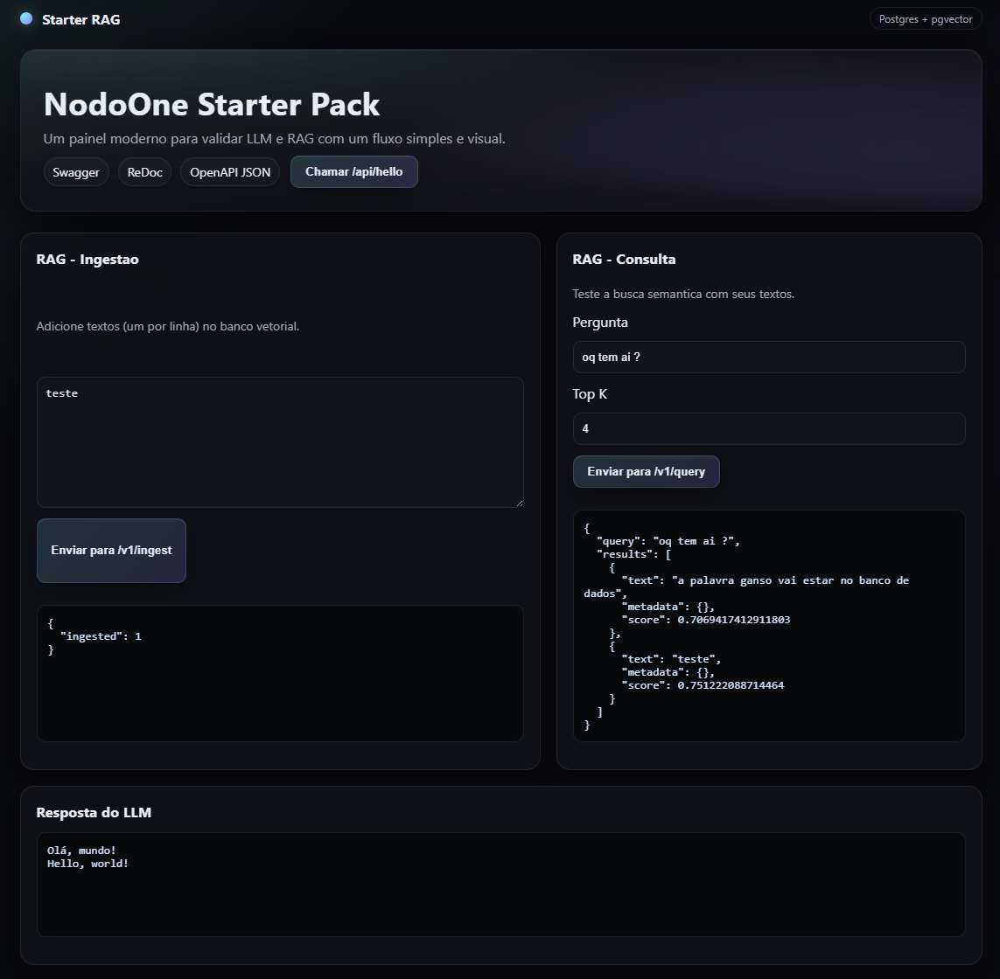

# NodoOne Starter Pack


**NodoOne Starter Pack** is a production-ready FastAPI + LangChain kit with Postgres + pgvector RAG, Redis cache, observability, and CI. Designed to be the base for multiple applications.

## Screenshot


## What you get
- FastAPI app with Swagger/ReDoc
- LangChain + OpenAI ready
- Postgres + pgvector RAG (ingest + query)
- Redis cache for RAG queries
- Static UI to validate LLM + RAG
- API versioning (`/v1/...`) with legacy route
- Health and readiness endpoints
- Prometheus metrics (`/metrics`)
- Optional OpenTelemetry tracing
- Per-route rate limiting (v1 routes)
- Structured logs + request-id
- Dockerized with non-root user + healthcheck
- CI + secret scan (Gitleaks)
- Dependabot updates

## Tech Stack
- Python 3.11
- FastAPI + Uvicorn
- LangChain + OpenAI
- Postgres + pgvector
- Redis
- Docker + Docker Compose

## Project Structure
```
.
├─ main.py
├─ settings.py
├─ static/
│  ├─ index.html
│  └─ index2.html
├─ tests/
│  └─ test_health.py
├─ docker-compose.yml
├─ Dockerfile
├─ requirements.txt
├─ requirements-dev.txt
├─ .env.example
├─ .pre-commit-config.yaml
├─ .gitleaks.toml
└─ README.md
```

## Quickstart (Docker)
1. Copy `.env.example` to `.env` and set `OPENAI_API_KEY`.
2. Run:

```bash
docker compose up --build
```

Open `http://localhost:8000/`.

## Local Development
```bash
pip install -r requirements.txt -r requirements-dev.txt
pytest
```

## API Endpoints
- `/` Static page
- `/v1/hello` LLM response (versioned)
- `/v1/ingest` Ingest texts into the vector DB
- `/v1/query` Query similar chunks from the vector DB
- `/api/hello` Legacy route (deprecated)
- `/api/dashboard` Cache + RAG status
- `/docs` Swagger
- `/redoc` ReDoc
- `/metrics` Prometheus metrics
- `/health` Healthcheck
- `/ready` Readiness

## RAG Quick Test (UI)
1. Start with Docker: `docker compose up --build`
2. Open `http://localhost:8000/`
3. Use the RAG section to ingest a few lines and query

## Configuration
Environment variables (see `.env.example`):
- `OPENAI_API_KEY`
- `MODEL` (default: `gpt-4o-mini`)
- `EMBEDDING_MODEL` (default: `text-embedding-3-small`)
- `TEMPERATURE`
- `REQUEST_TIMEOUT`
- `MAX_RETRIES`
- `ALLOWED_ORIGINS`
- `DATABASE_URL`
- `RAG_COLLECTION`
- `ENABLE_RATE_LIMIT`
- `RATE_LIMIT_PER_MINUTE`
- `REDIS_URL`
- `CACHE_TTL_SECONDS`
- `ENABLE_METRICS`
- `ENABLE_TRACING`
- `OTEL_SERVICE_NAME`
- `OTEL_EXPORTER_OTLP_ENDPOINT`

## Observability
- Metrics: scrape `http://localhost:8000/metrics` with Prometheus.
- Tracing: set `ENABLE_TRACING=true` and `OTEL_EXPORTER_OTLP_ENDPOINT` (OTLP/HTTP).

## Security
- Never commit secrets. Use `.env` (gitignored).
- Run `pre-commit install` to enable local secret scanning.
- CI runs secret scanning on each push/PR.

## Contributing
See `.github/CONTRIBUTING.md`.

## License
MIT. See `LICENSE`.
